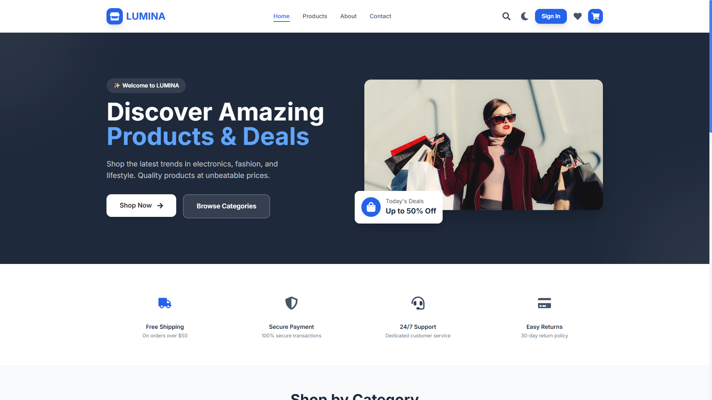
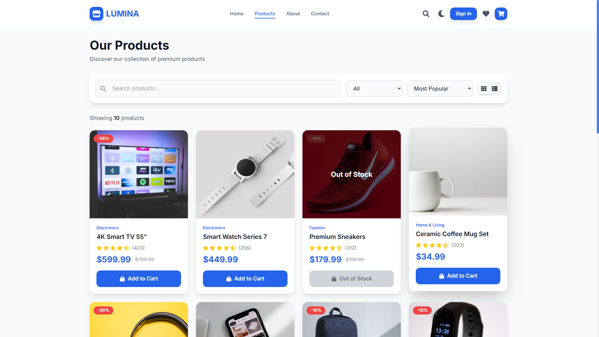
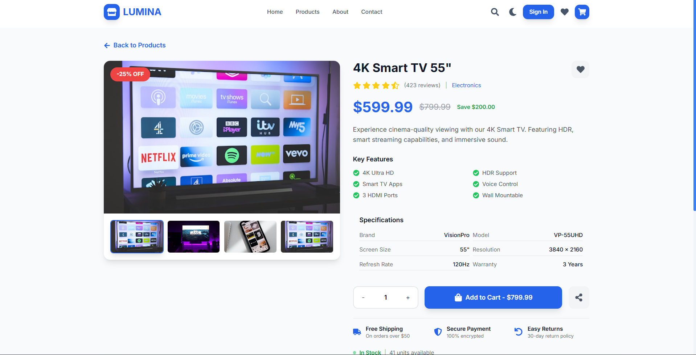
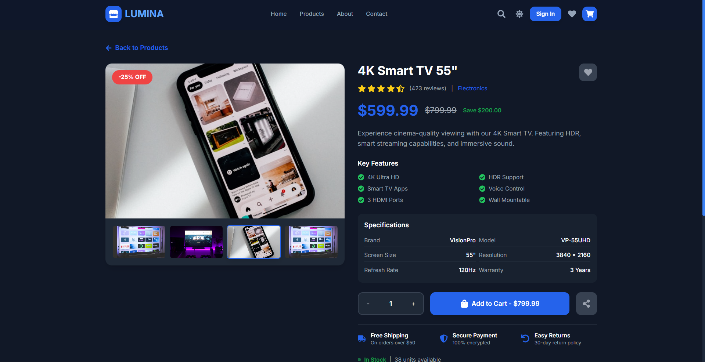
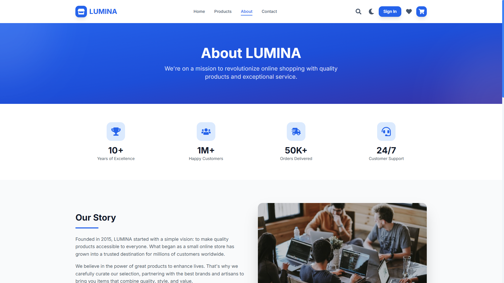
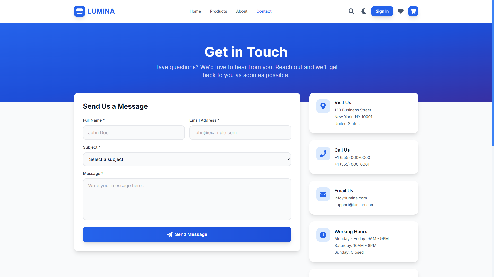

# 🛍️ LUMINA — Modern E-Commerce Frontend

<div align="center">

A premium, fully responsive e-commerce frontend built with **React**, **TypeScript**, and **Tailwind CSS**, delivering a modern shopping experience with elegant UI, smooth animations, and a sleek dark theme.

### 🌐 Live Demo
**https://buylumina.vercel.app**

</div>

---

## ✨ Overview

**LUMINA** is a modern e-commerce frontend focused on delivering an intuitive and visually appealing shopping experience. Built with the latest React ecosystem, it features responsive layouts, animated interactions, theme switching, and a complete shopping workflow—from browsing products to checkout.

Whether viewed on desktop, tablet, or mobile, LUMINA provides a seamless, production-quality user interface suitable for showcasing modern frontend development skills.

---

## 🚀 Features

### 🎨 Modern User Experience

- ✨ Premium black & light themes
- 📱 Fully responsive across all devices
- ⚡ Smooth page transitions and animations with Framer Motion
- 🎯 Clean, intuitive, and accessible UI
- 🌙 Theme toggle with persistent user preference

---

### 🛒 Shopping Experience

- 🔍 Advanced product search
- 🏷️ Category-based filtering
- ↕️ Product sorting options
- 📦 Dynamic product detail pages
- 🖼️ Interactive product image gallery
- ➕ Quantity selector
- ❤️ Wishlist interface
- 🛍️ Shopping cart management
- 🎟️ Promo code support
- 💳 Multi-step checkout flow

---

### 👤 User Features

- Login & Registration modals
- Form validation
- Responsive navigation
- Mobile slide-out menu
- Persistent shopping cart
- Theme persistence

---

### 📄 Additional Pages

- Home
- Products
- Product Details
- Cart
- Checkout
- About
- Contact

---

# 📸 Screenshots

## Home



---

## Products



---

## Product Details



---

## Black Theme



---

## About



---

## Contact



---

# 🛠️ Tech Stack

| Technology | Description |
|------------|-------------|
| ⚛️ React 19 | Modern UI library |
| 📘 TypeScript | Type-safe JavaScript |
| 🎨 Tailwind CSS | Utility-first CSS framework |
| 🎬 Framer Motion | Smooth animations & transitions |
| 🧭 React Router v7 | Client-side routing |
| 🐻 Zustand | Lightweight state management |
| 🎯 React Icons | Beautiful icon library |
| ⚡ Vite | Lightning-fast build tool |

---

# 📂 Project Structure

```text
src/
│
├── components/
│   ├── auth/
│   ├── common/
│   ├── layout/
│   └── ui/
│
├── context/
│   ├── AuthContext
│   ├── CartContext
│   └── ThemeContext
│
├── pages/
│   ├── Home
│   ├── Products
│   ├── ProductDetail
│   ├── Cart
│   ├── Checkout
│   ├── About
│   └── Contact
│
├── hooks/
├── types/
├── assets/
├── App.tsx
└── main.tsx
```

---

# ⚙️ Getting Started

## 1️⃣ Clone the Repository

```bash
git clone https://github.com/your-username/lumina-ecommerce.git
```

```bash
cd lumina-ecommerce
```

---

## 2️⃣ Install Dependencies

```bash
npm install
```

---

## 3️⃣ Run Development Server

```bash
npm run dev
```

Open your browser:

```
http://localhost:5173
```

---

## 4️⃣ Build for Production

```bash
npm run build
```

---

## 5️⃣ Preview Production Build

```bash
npm run preview
```

---

# 🌙 Theme Support

LUMINA includes two elegant UI themes:

- ☀️ Light Theme
- 🌑 Premium Black Theme

Users can switch themes instantly using the toggle available in the navigation bar. The selected theme persists across sessions for a consistent experience.

---

# 🎯 Highlights

- Modern SaaS-inspired UI
- Premium black theme
- Responsive design
- Interactive animations
- Clean component architecture
- Reusable UI components
- Type-safe codebase
- Fast development with Vite
- Scalable project structure
- Excellent developer experience

---

# 📌 Future Improvements

- Backend integration
- User authentication API
- Product reviews & ratings
- Order history
- Payment gateway integration
- Wishlist persistence
- Product recommendations
- Admin dashboard
- Search suggestions
- Pagination & infinite scrolling

---

# 📝 Notes

- This project is currently **frontend-only**.
- Product data is mock data for demonstration purposes.
- The architecture is designed to be easily connected to a REST API or backend service in the future.

---

# 🤝 Contributing

Contributions are welcome!

If you'd like to improve the project:

1. Fork the repository
2. Create a feature branch

```bash
git checkout -b feature/YourFeature
```

3. Commit your changes

```bash
git commit -m "Add amazing feature"
```

4. Push the branch

```bash
git push origin feature/YourFeature
```

5. Open a Pull Request

---

# ⭐ Support

If you found this project helpful, consider giving it a ⭐ on GitHub.

It helps others discover the project and motivates future improvements.

---

# 📄 License

This project is licensed under the **MIT License**.

---

<div align="center">

## Built with ❤️ using React, TypeScript & Tailwind CSS

**LUMINA** — Modern UI. Seamless Shopping. Exceptional Experience.

</div>